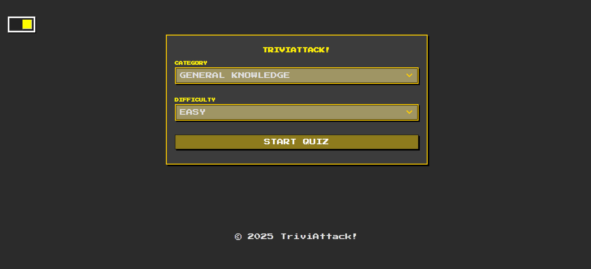
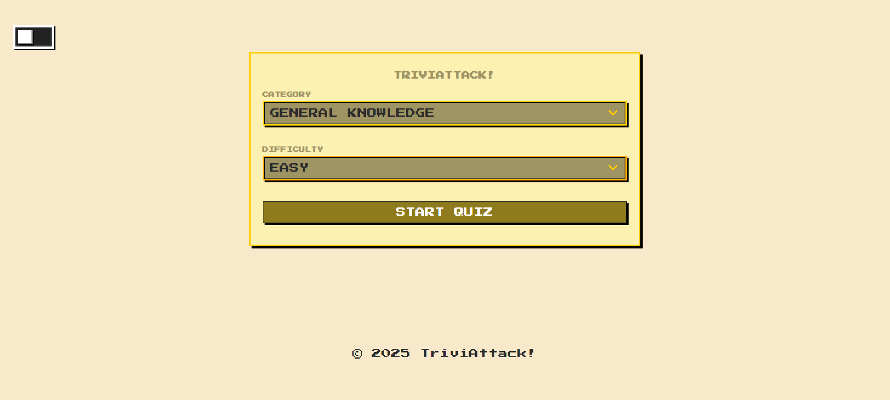
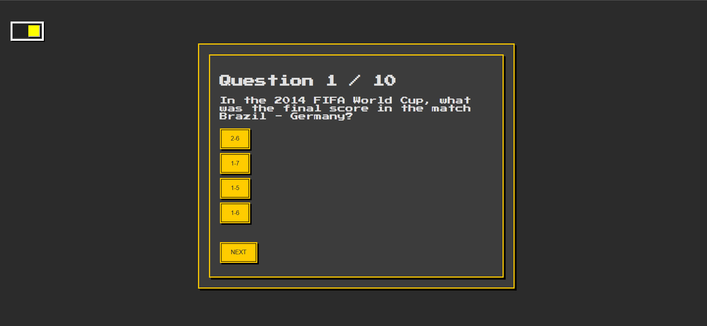

# TriviAttack

TriviAttack is a trivia-based web application built with Angular. Players can answer questions, compete for scores, and test their knowledge across different categories.

---

## Features

- Multiple-choice trivia questions
- Dark/Light Mode
- Score tracking
- Category-based quizzes
- Pixel Art styled menus

---

## Tech Stack

- **Framework:** Angular
- **Language:** TypeScript
- **Styling:** CSS
- **Tooling:** Angular CLI

---

## Screenshots





## Installation

Clone the repository and install dependencies:

```bash
git clone https://github.com/ibrahimitani0/triviattack.git
cd triviattack
npm install
```
